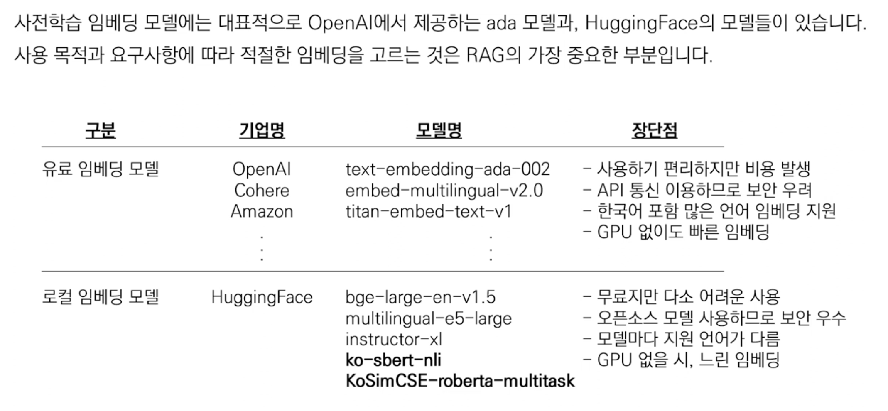

# Embedding

- 텍스트를 숫자로 변환하여 문장간의 유사성을 비교할 수 있다

- 문자를 숫자로 바꿔서 좌표상에 위치 시킬 수 있다
- 다차원의 벡터로 비정형 모델을 정형 형태로 바꿀 수 있다
- 좌표상에서 가장 가까운 문장을 찾을 수 있다

문장을 어떻게 임베딩 모델로 변환할까?
1. 대용량의 말뭉치로 임베딩 모델 훈련
2. pre-trained embedding (사전학습) 모델 생성가능
    - 학습되지 않은 모델로도 숫자로 바꾸는 역할을 할 수 있다 
    - 너무 많은 문장을 이미 학습했고
    - 그 중 처음본 문장과 유사한 문장들이 있을 수 있다
    - 처음보는 문장이라도 유사한 문장의 수치를 적용할 수 있다

1. 유로 임베딩 모델
    - 회사에서 본인들이 모은 데이터로 구축한 모델
    - api call로 텍스트를 보내면 수치를 받을 수 있다
2. 로컬 임베딩 모델
    - 회사에서 많이 사용
    - 외부로 데이터 유출될 일이 없음 (보안 우수)
    - 매개변수 설정이 어려움
    - 모델마다 지원하는 언어가 다름
    - 허깅페이스의 모델에서 bge-large-en-v1.5 모델은 영어를 위주로 임베딩을 잘한다
    - GPU가 없으면 임베딩이 느림
    - 어떤 임베딩 모델이 내 텍스트를 벡터화할 때 좋을까를 고민해야 한다
    - 허깅페이스에 언어마다 잘하는 모델을 보여준다

