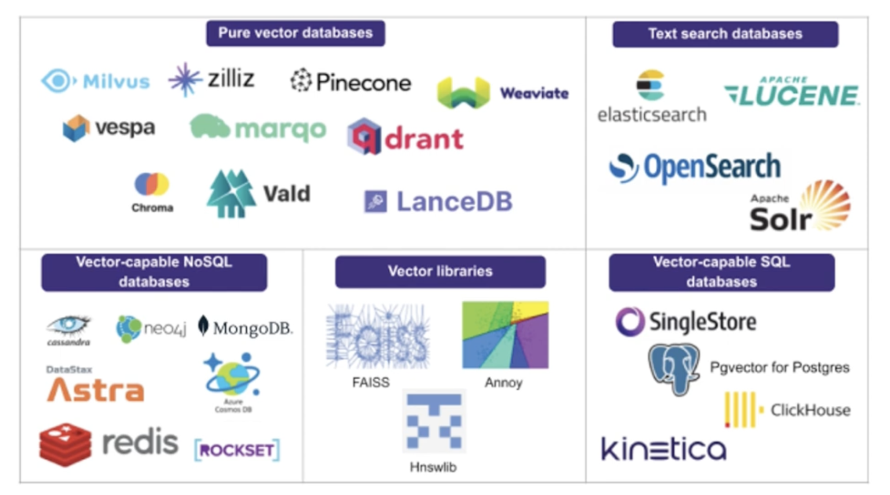

# Vector Store

1. Pure vector store
    - DB의 기능처럼 **벡터 저장, 검색, 삭제 등 기능** 제공
    - **텍스트를 벡터로 변환하여 저장하고, 유사도 측정해서 텍스트로 반환**
    - Pinecone, Chroma(오픈소스), Qdrant, Weaviate, Milvus
2. Vector library
    - **벡터 유사도 측정**에 특화된 라이브러리, 저장도 가능 (빈약, 유지보수 어려움)
    - FAISS, Annoy, HNSW

